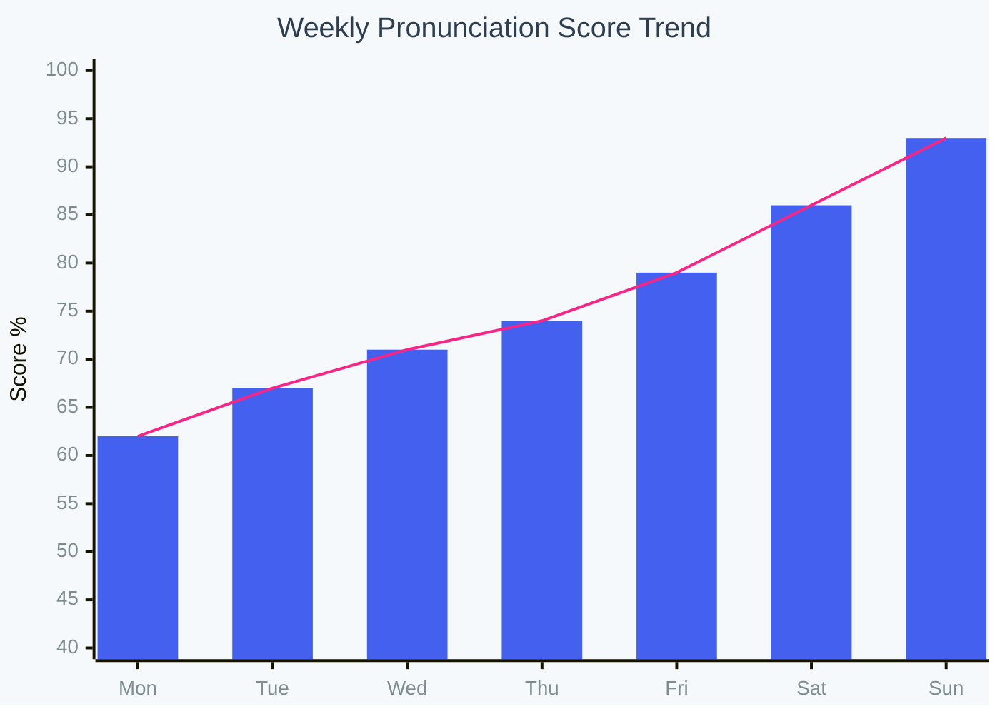
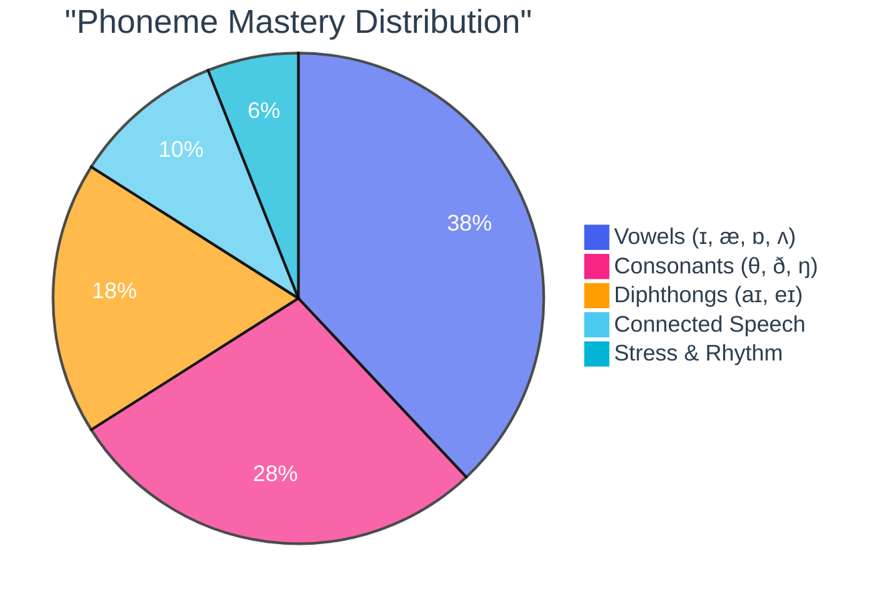
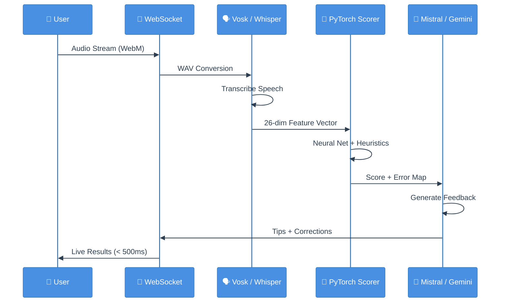
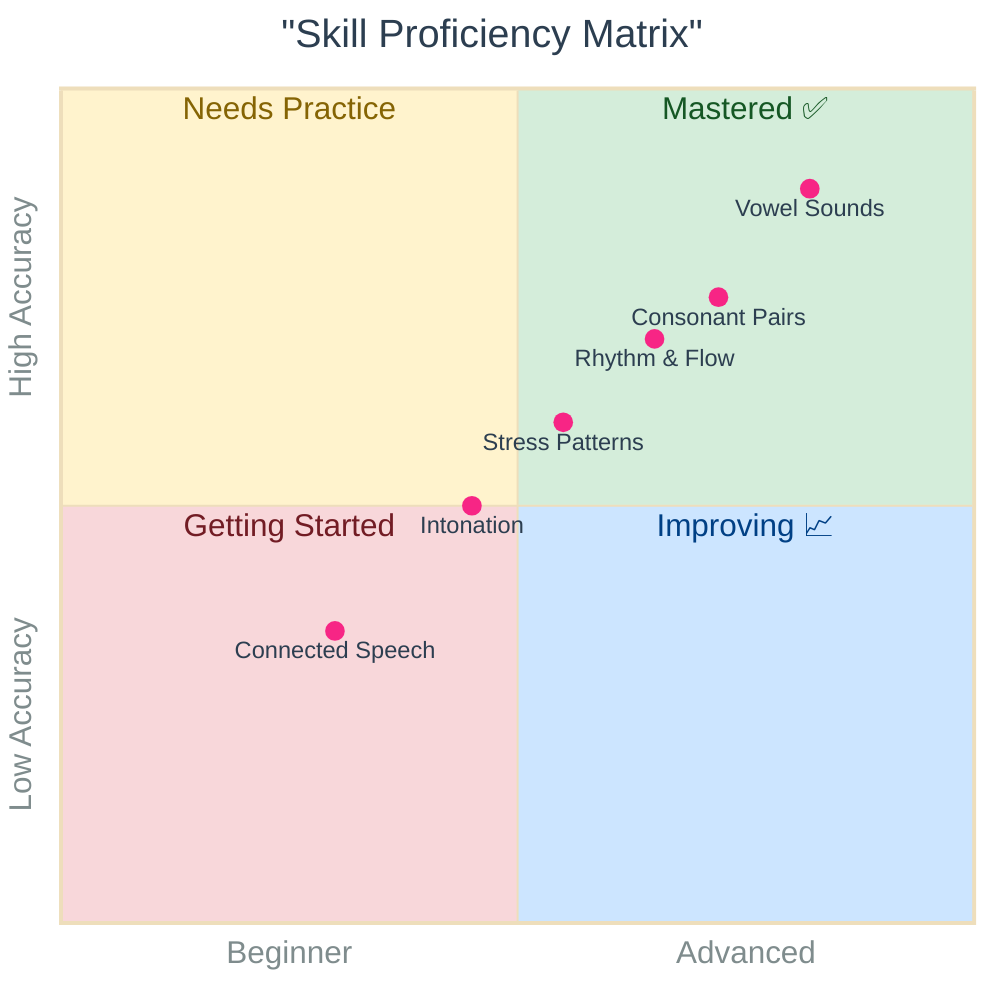
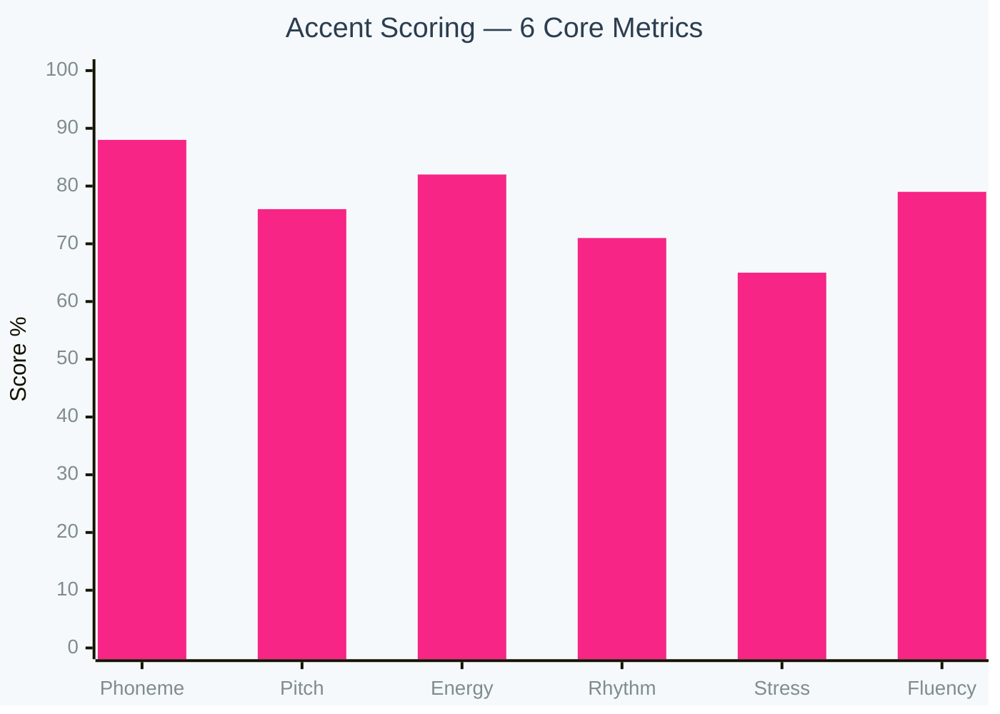
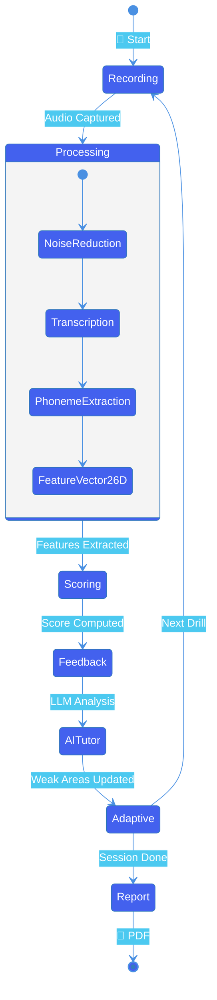

```mermaid
%%{init: {'theme': 'base', 'themeVariables': {'primaryColor': '#4361EE', 'primaryBorderColor': '#357ABD', 'primaryTextColor': '#ffffff', 'lineColor': '#4A90E2', 'secondaryColor': '#F72585', 'tertiaryColor': '#4CC9F0'}}}%%
flowchart LR
    A["🎤 User Audio"] --> B["🔌 WebSocket"]
    B --> C["🔇 Noise Reduction"]
    C --> D["🗣️ Vosk / Whisper STT"]
    D --> E["🔤 g2p_en Phonemes"]
    E --> F["📊 Feature Extraction"]
    F --> G["🧠 PyTorch Scorer"]
    G --> H{"Score > 70?"}
    H -->|Yes| I["✅ Pass — Next Level"]
    H -->|No| J["🔄 Targeted Drills"]
    G --> K["🤖 Mistral / Gemini LLM"]
    K --> L["💬 Real-time Feedback"]
    L --> M["📱 React / Flutter UI"]

    style A fill:#4361EE,stroke:#357ABD,color:#fff
    style B fill:#FF9E00,stroke:#e68a00,color:#fff
    style C fill:#4CC9F0,stroke:#00B4D8,color:#fff
    style D fill:#7209B7,stroke:#5a0791,color:#fff
    style E fill:#F72585,stroke:#d41e6e,color:#fff
    style F fill:#00B4D8,stroke:#009bb8,color:#fff
    style G fill:#4361EE,stroke:#357ABD,color:#fff
    style H fill:#FFD60A,stroke:#e6c009,color:#2C3E50
    style I fill:#2ECC71,stroke:#27AE60,color:#fff
    style J fill:#E74C3C,stroke:#C0392B,color:#fff
    style K fill:#FF9E00,stroke:#e68a00,color:#fff
    style L fill:#F72585,stroke:#d41e6e,color:#fff
    style M fill:#4A90E2,stroke:#357ABD,color:#fff
```

<p align="center">
  
</p>

<h1 align="center">AI Accent Builder</h1>

<p align="center">
  <strong>A complete AI-powered British English accent training platform with real-time WebSocket monitoring, adaptive course engine, intelligent LLM tutor, and modern analytics dashboard.</strong>
</p>

<p align="center">
  
  
  
  
  
  
  
</p>

<p align="center">
  
  
  
  
  
</p>

<p align="center">
  
  
  
  
  
</p>

<p align="center">
  <a href="#-1">Features</a> •
  <a href="#-6">Architecture</a> •
  <a href="#-7">How It Works</a> •
  <a href="#-8">Tech Stack</a> •
  <a href="#-9">Getting Started</a> •
  <a href="#-10">API</a>
</p>

---

### Built With

<table>
  <tr>
    <td align="center"></td>
    <td align="center"></td>
    <td align="center"></td>
    <td align="center"></td>
    <td align="center"></td>
  </tr>
  <tr>
    <td align="center">Backend</td>
    <td align="center">Web Frontend</td>
    <td align="center">REST + WS API</td>
    <td align="center">ML Scoring</td>
    <td align="center">Mobile App</td>
  </tr>
  <tr><td colspan="5"></td></tr>
  <tr>
    <td align="center"></td>
    <td align="center"></td>
    <td align="center"></td>
    <td align="center"></td>
    <td align="center"></td>
  </tr>
  <tr>
    <td align="center">AI Tutor (Fallback)</td>
    <td align="center">AI Tutor (Primary)</td>
    <td align="center">Speech-to-Text</td>
    <td align="center">Grammar AI</td>
    <td align="center">NLP Engine</td>
  </tr>
  <tr><td colspan="5"></td></tr>
  <tr>
    <td align="center"></td>
    <td align="center"></td>
    <td align="center"></td>
    <td align="center"></td>
    <td align="center"></td>
  </tr>
  <tr>
    <td align="center">Real-Time Comm</td>
    <td align="center">Database</td>
    <td align="center">Analytics Charts</td>
    <td align="center">Frontend Logic</td>
    <td align="center">Styling</td>
  </tr>
</table>

---

##  

The **AI Accent Builder** follows a complete end-to-end pipeline designed to help non-native speakers develop a natural British English accent through analysis, comparison, and feedback. The process begins when the user records their voice through a microphone using a  **React**-based web interface or a  **Flutter** mobile application. The recorded audio is saved in WebM format and converted to a 16kHz mono WAV file using **pydub** for consistent processing. This audio is then passed to a speech-to-text module, where **Vosk** is used as the primary offline ASR engine and  **Whisper** is used as a fallback to improve accuracy. The speech-to-text process produces both the transcribed text and word-level timestamps.

Using the transcribed text, a British English reference speech sample is generated through **pyttsx3** text-to-speech, which represents a correct native British accent. Both the user's speech and the reference British speech are analysed in parallel. Acoustic and accent-related features are extracted using **librosa** and **parselmouth (Praat)**, including pitch (F0), stress intensity, rhythm, intonation patterns, speaking rate, pause duration, MFCCs, and vowel formants (F1, F2, F3). To achieve precise word and phoneme alignment, forced alignment is applied using Vosk timestamps combined with **g2p_en** phoneme mapping.

Accent comparison is then performed using multiple techniques: **Dynamic Time Warping (fastdtw)** aligns pitch, MFCC, and energy features spoken at different speeds; **Pearson correlation** measures similarity in pitch and energy contours; **ratio-based timing analysis** evaluates rhythm and stress balance; and **Levenshtein edit distance** detects pronunciation and phoneme-level deviations. In addition, a custom  **PyTorch**-based pronunciation scoring model trained on the **SpeechOcean762** dataset predicts pronunciation quality across accuracy, fluency, completeness, prosody, and overall score.

These results are combined using a **weighted scoring system** that evaluates phoneme accuracy, pitch similarity, timing, stress, vowel quality, and fluency to produce detailed accent scores at sentence, word, and phoneme levels. The feedback is presented visually and audibly through the frontend, where incorrect words and phonemes are highlighted, correct British accent segments are playable, and simple improvement tips are shown. The entire recording and practice experience uses  **WebSocket** connections that process speech in real time — words appear as you speak, phonemes are colour-coded live, and the AI tutor responds instantly, giving the natural feel of talking to a real person rather than waiting for a delayed result. To support natural conversation practice, the transcribed text is also processed through British English grammar and vocabulary modules using **LanguageTool**,  **FLAN-T5**, and  **spaCy**. The system features an intelligent **AI tutor** powered by  **Mistral LLM** (open-source, self-hosted) as the primary model for fast, private, zero-cost inference; if the system does not support Mistral, the tutor automatically falls back to  **Google Gemini API (gemini-2.5-flash)** to ensure it is always available regardless of hardware. The platform also includes a **smart monitoring dashboard** with real-time  **Chart.js** analytics, and an **adaptive course engine** that continuously analyses user reports and mistakes to **automatically update courses and practice content** — no two users see the same exercises. Each user receives a **personalised learning roadmap** that auto-generates weekly milestones, identifies weak areas, schedules targeted drills for specific phonemes and metrics, and updates itself after every session based on the latest scores. All scores, sessions, and progress data are stored through a  **FastAPI** backend with  **SQLite**, ultimately helping users gradually adopt authentic British English accent patterns through personalised, data-driven learning.

---

## 

### 

| Feature | Description |
|---------|-------------|
| **Shadowing Practice** | Listen to native British audio, record your speech, and get scored across 6 metrics |
| **Real-Time WebSocket Feedback** | Live phoneme-by-phoneme feedback with < 500ms latency via persistent WebSocket connections |
| **Hybrid Scoring** | Combines rule-based, signal-processing, and ML approaches for accurate assessment |
| **Grammar Checking** | British English grammar correction with LanguageTool + FLAN-T5 |
| **AI Tutor (Gemini LLM)** | A real AI tutor that analyses your mistakes, explains how to improve, gives tips, and asks follow-up questions |
| **Adaptive Course Engine** | Dynamically updates course content based on your weak areas and skill level |
| **Smart Monitoring Dashboard** | Modern Chart.js-powered analytics with real-time performance tracking |
| **Progress Tracking** | Long-term session history, improvement trends, and streak tracking |
| **PDF Reports** | Downloadable assessment reports with charts and detailed scores |

---

### 

A modern, visually rich dashboard that monitors every aspect of the user's learning journey in real time:

-  **Live Performance Charts** — Interactive line, bar, doughnut, and radar charts powered by  showing scores over time, metric breakdowns, and session comparisons
-  **Collapsible Sidebar Navigation** — Quick access to all modules with badge indicators for pending tasks
-  **Stats Grid** — At-a-glance cards displaying overall score, total sessions, current streak, accuracy rate, and time practised
-  **Module Progress Cards** — Visual progress bars for each learning module (Shadowing, Pronunciation, Grammar, Conversation)
-  **Session Timeline** — Chronological view of all practice sessions with per-session scores
-  **Responsive Layout** — Fully adaptive from desktop (4-column charts) to tablet (2-column) to mobile (stacked)
-  **Smooth Animations** — Micro-interactions, hover effects, and transition animations for a premium feel
-  **Dark / Light Theme** -  variable-based theming defined in `index.css`

<br/>

<h3 align="center">
  
</h3>

<p align="center">
  
  
  
</p>

<table>
<tr>
<td width="50%">

####  Pronunciation Scores



</td>
<td width="50%">

####  Phoneme Accuracy



</td>
</tr>
</table>

<table>
<tr>
<td width="50%">

####  Real-Time Analysis Flow



</td>
<td width="50%">

####  Learning Proficiency



</td>
</tr>
</table>

<table>
<tr>
<td width="50%">

####  6-Metric Breakdown



</td>
<td width="50%">

####  User Session Flow



</td>
</tr>
</table>

<table>
<tr>
<td width="100%">

####  End-to-End Data Flow



</td>
</tr>
</table>

<p align="center">
  
  
  
  
  
  
  
  
  
</p>
<p align="center">
  
  &nbsp;
  
  &nbsp;
  
  &nbsp;
  
</p>

---

###  — Talk Like a Real Person

The platform uses **persistent WebSocket connections** for all real-time features. During recording, the system processes your speech **live** and responds instantly — giving you the natural, conversational feel of talking to a real person, not waiting for a delayed batch result.

**How it feels:**
> You speak → words appear in real time → phoneme colours update live → the AI tutor responds immediately — just like having a real British English teacher sitting next to you.

```
Client (React / Flutter)                    Server (FastAPI)
       │                                          │
       │ ──── ws://localhost:8000/ws/pronunciation ─►│  ← Connection opened
       │                                          │
       │ ──── Send target text ─────────────────► │
       │                                          │
       │ ──── Stream audio chunks (16kHz) ──────► │  ← Process each chunk
       │                                          │
       │ ◄──── Live transcription ─────────────── │  ← Words appear as you speak
       │ ◄──── Phoneme update (every ~500ms) ──── │  ← Colour-coded right/wrong
       │ ◄──── Prosody score update ────────────── │  ← librosa + PyTorch
       │ ◄──── Live metric bars ────────────────── │  ← Real-time UI update
       │ ◄──── AI tutor response (streamed) ────── │  ← Instant conversational reply
       │                                          │
       │ ──── Stop signal ──────────────────────► │
       │ ◄──── Final assessment JSON ───────────── │
       │                                          │
```

**WebSocket Endpoints:**

| Endpoint | Purpose | Data Flow |
|----------|---------|----------|
| `/ws/pronunciation` | Real-time phoneme feedback during recording | Audio chunks → live phoneme + prosody updates |
| `/ws/transcribe` | Live transcription — words appear as you speak | Audio chunks → partial text in real time |
| `/ws/tutor` | AI tutor conversation — instant replies like a real person | User message → streamed LLM response |

---

###  — Mistral LLM + Gemini Fallback

The platform features an intelligent AI tutor that acts as a **real British English teacher**, powered by a dual-LLM strategy:

- **Primary:** **Mistral LLM** (open-source, self-hosted) — runs locally for fast, private, zero-cost inference
- **Fallback:** **Google Gemini API** (gemini-2.5-flash) — automatically activated if the system does not support Mistral or local resources are limited

This ensures the tutor is **always available** regardless of hardware.

```
┌───────────────────────────────────────────────────────────┐
│                   AI TUTOR ENGINE                         │
│                                                           │
│   ① Try Mistral LLM (local, open-source)                 │
│      └── If supported → fast, private, free              │
│                                                           │
│   ② Fallback to Gemini API (cloud)                       │
│      └── If Mistral unavailable → use gemini-2.5-flash   │
│                                                           │
│   ③ Fallback to FLAN-T5 (local, lightweight)             │
│      └── If no internet → basic grammar + tips           │
└───────────────────────────────────────────────────────────┘
```

| Tutor Capability | How It Works |
|------------------|--------------|
| **Mistake Analysis** | Receives your scores, transcription, and error details — explains exactly what went wrong |
| **How to Improve** | Provides specific, actionable tips like *"Try dropping the 'r' at the end of 'water' — British RP uses a silent 'r'"* |
| **Follow-Up Questions** | Asks contextual follow-ups to keep you practising — *"You mentioned going to the shop. What did you buy there?"* |
| **Grammar Feedback** | Highlights grammar mistakes inline with corrections and British English alternatives |
| **Vocabulary Coaching** | Suggests British vocabulary swaps (e.g., *"store → shop"*, *"apartment → flat"*) |
| **Encouragement** | Positive reinforcement with improvement trend tracking |
| **Adaptive Difficulty** | Adjusts question complexity based on your current skill level |
| **Conversational Feel** | Responds via WebSocket in real time — feels like chatting with a real person, not waiting for a page reload |

**Tutor Flow:**
```
User speaks → STT transcription → Grammar check → Accent scoring
                                        │
                        ┌───────────────┴───────────────┐
                        ▼                               ▼
              ┌──────────────────┐            ┌──────────────────┐
              │  MISTRAL LLM     │    OR      │  GEMINI API      │
              │  (Primary)       │  ────────► │  (Fallback)      │
              │  Open-source     │  if not    │  gemini-2.5-flash│
              │  Self-hosted     │  supported │  Cloud-based     │
              └────────┬─────────┘            └────────┬─────────┘
                       │                               │
                       └───────────────┬───────────────┘
                                       ▼
                              ┌──────────────────┐
                              │ Response:        │
                              │ [v] Feedback     │
                              │ [i] Tips         │
                              │ [>] Correction   │
                              │ [?] Follow-up Q  │
                              └──────────────────┘
```

---

###  & Auto-Updating Content

Courses and practice content **change automatically** — the system continuously analyses your reports and mistakes, then updates what you see next. No two users get the same experience.

| Feature | Description |
|---------|-------------|
| **Skill-Level Detection** | Automatically classifies user as Beginner / Intermediate / Advanced based on cumulative scores |
| **Weak-Area Identification** | Analyses the 6 accent metrics to find your weakest areas (e.g., low pitch similarity → more intonation drills) |
| **Auto Content Updates** | Practice sentences, exercises, and course modules **change automatically** after each session based on your latest report |
| **Progressive Difficulty** | Gradually increases sentence length, speed, and complexity as you improve |
| **Mistake-Based Drills** | If you consistently mispronounce certain phonemes (e.g., /θ/ → /t/), the system creates targeted drills automatically |
| **Course Modules** | Structured modules for Intonation, Stress, Vowels, Connected Speech, and Conversation |

**Adaptive Flow:**
```
 Session Scores                     Adaptive Engine                    Auto-Updated Content
┌──────────────┐                  ┌──────────────────┐               ┌──────────────────┐
│ Phoneme: 85% │                  │ Analyse weakest  │               │ Next Session:    │
│ Pitch:   62% │ ◄── weakest ──► │ metrics across    │──────────────►│ • Intonation     │
│ Timing:  90% │                  │ last 5 sessions   │               │   practice ×3    │
│ Stress:  78% │                  │                   │               │ • Pitch matching │
│ Vowel:   70% │ ◄── weak ─────► │ Generate targeted │               │   exercises      │
│ Fluency: 88% │                  │ practice content  │               │ • Vowel drills   │
└──────────────┘                  └──────────────────┘               └──────────────────┘
```

---

### 

Every user gets a **unique, auto-generated learning roadmap** based on their performance history, mistake patterns, and goals:

```
┌─────────────────────────────────────────────────────────────────────────┐
│                     PERSONAL ROADMAP — User: Ahmed                     │
├─────────────────────────────────────────────────────────────────────────┤
│                                                                         │
│  Current Level: Intermediate (B1)          Overall Score: 72%          │
│                                                                         │
│  [DONE] Week 1 — Basics (COMPLETED)                                   │
│     └── Vowel sounds, basic greetings, simple sentences                │
│                                                                         │
│  [DONE] Week 2 — Intonation (COMPLETED)                                │
│     └── Rising/falling patterns, question intonation                   │
│                                                                         │
│  [ACTIVE] Week 3 — Stress & Rhythm (IN PROGRESS)     <-- You are here  │
│     └── Word stress, sentence rhythm, weak forms                       │
│     └── Focus: Your stress score is 65% — extra drills added           │
│                                                                         │
│  ⬚ Week 4 — Connected Speech (UPCOMING)                                │
│     └── Linking, elision, assimilation                                 │
│     └── Auto-adjusted based on Week 3 results                          │
│                                                                         │
│  ⬚ Week 5 — Conversation Fluency (UPCOMING)                           │
│     └── Real-time AI tutor conversations                               │
│     └── Content will auto-update based on your progress                │
│                                                                         │
│  [ANALYTICS] Weak Areas (auto-detected):                                        │
│     • Pitch similarity: 62% → extra intonation drills scheduled        │
│     • Vowel quality: 70% → vowel-focused exercises added               │
│     • /θ/ sound: frequently replaced with /t/ → targeted practice      │
│                                                                         │
└─────────────────────────────────────────────────────────────────────────┘
```

| Roadmap Feature | Description |
|-----------------|-------------|
| **Auto-Generated** | Created automatically when a user completes their first session |
| **Weekly Structure** | Organised into weekly milestones with clear goals |
| **Live Updates** | Roadmap updates after every session based on latest scores and mistakes |
| **Weak-Area Focus** | Automatically schedules extra drills for your weakest metrics |
| **Phoneme Tracking** | Tracks specific sounds you struggle with and adds targeted practice |
| **Goal Setting** | Shows target scores and estimated time to reach next level |

---

## 

```
┌─────────────────────────────────────────────────────────────────────────┐
│                          CLIENT LAYER                                   │
│  ┌──────────────────────┐          ┌──────────────────────┐            │
│  │     React Web App    │          │   Flutter Mobile App  │            │
│  │  Dashboard, Practice │          │   iOS / Android       │            │
│  │  Modals, Progress    │          │   Accent Analysis     │            │
│  └──────────┬───────────┘          └──────────┬───────────┘            │
└─────────────┼──────────────────────────────────┼────────────────────────┘
              │  REST API / WebSocket            │
              ▼                                  ▼
┌─────────────────────────────────────────────────────────────────────────┐
│                        FASTAPI BACKEND (Port 8000)                      │
│                                                                         │
│  ┌─────────────────────────────── ROUTERS ───────────────────────────┐  │
│  │  auth  │  shadowing  │  grammar  │  progress  │  report  │  accent│  │
│  └────────┴─────────────┴───────────┴────────────┴──────────┴────────┘  │
│                                                                         │
│  ┌──────────────────────────── SERVICES ─────────────────────────────┐  │
│  │                                                                    │  │
│  │  ┌─── AI / ML ───────────────────────────────────────────────┐    │  │
│  │  │  STT (Vosk + Whisper)  │  TTS (pyttsx3)                  │    │  │
│  │  │  Trained Scorer (PyTorch)  │  Hybrid Pronunciation       │    │  │
│  │  │  Grammar (LanguageTool + FLAN-T5)  │  Gemini API         │    │  │
│  │  └───────────────────────────────────────────────────────────┘    │  │
│  │                                                                    │  │
│  │  ┌─── Audio Processing ──────────────────────────────────────┐    │  │
│  │  │  Audio Analysis (librosa)  │  Acoustic Analysis (Praat)   │    │  │
│  │  │  Audio Enhancement (noisereduce)  │  Formant Analysis     │    │  │
│  │  └───────────────────────────────────────────────────────────┘    │  │
│  │                                                                    │  │
│  │  ┌─── NLP ──────────────────────────────────────────────────┐     │  │
│  │  │  Phoneme Comparison (g2p_en + Levenshtein)               │     │  │
│  │  │  Stress Detection  │  Connected Speech  │  Vocabulary    │     │  │
│  │  └───────────────────────────────────────────────────────────┘     │  │
│  └────────────────────────────────────────────────────────────────────┘  │
│                                                                         │
│  ┌─────────────────────── DATABASE (SQLite) ─────────────────────────┐  │
│  │  Users  │  Sessions  │  Progress  │  Recordings  │  Courses       │  │
│  └───────────────────────────────────────────────────────────────────┘  │
└─────────────────────────────────────────────────────────────────────────┘
```

---

## 

### End-to-End Pipeline

```
 ① Record          ② Transcribe        ③ Generate Reference     ④ Extract Features
┌──────────┐      ┌──────────┐         ┌──────────┐             ┌──────────────────┐
│  User   │─────▶│  Vosk /  │────────▶│ pyttsx3  │────────────▶│ librosa: MFCC,   │
│  speaks  │ WebM │ Whisper  │ text +  │ British  │ native WAV  │   RMS, Spectral  │
│          │──┐   │   STT    │ stamps  │   TTS    │             │ Praat: F0, F1-F3 │
└──────────┘  │   └──────────┘         └──────────┘             │ g2p_en: Phonemes │
              │                                                  └────────┬─────────┘
              │                                                           │
              │   ⑤ Compare (Hybrid)                     ⑥ Score Fusion  │
              │  ┌──────────────────────────────┐     ┌──────────────┐   │
              └─▶│ DTW: pitch/MFCC alignment    │────▶│ Weighted Avg │◀──┘
                 │ Levenshtein: phoneme match   │     │              │
                 │ Pearson: feature correlation │     │ 6 Metrics ─▶│ Overall %
                 │ Ratio: timing analysis       │     │ PASS/REPEAT  │
                 │ PyTorch: ML scoring (5 dims) │     └──────┬───────┘
                 └──────────────────────────────┘            │
                                                             ▼
                 ⑦ Feedback              ⑧ Conversation     ⑨ Track Progress
                ┌──────────────┐       ┌──────────────┐   ┌──────────────┐
                │ Visual bars  │       │ Grammar:     │   │ FastAPI +    │
                │ Phoneme tips │       │  LanguageTool│   │ SQLite DB    │
                │ Audio replay │       │  FLAN-T5     │   │ Session logs │
                │ Score cards  │       │ Follow-up:   │   │ PDF Reports  │
                └──────────────┘       │  Gemini API  │   └──────────────┘
                                       └──────────────┘
```

### Six Accent Metrics

| Metric | Weight | Technique | What It Measures |
|--------|--------|-----------|------------------|
| **Phoneme Match** | 25% | g2p_en + Levenshtein | Correct sounds produced |
| **Pitch Similarity** | 20% | parselmouth + DTW | Intonation patterns |
| **Timing Accuracy** | 15% | Duration ratio | Speaking rate & rhythm |
| **Stress Accuracy** | 15% | RMS energy + DTW | Emphasis patterns |
| **Vowel Quality** | 10% | Formant analysis (F1, F2, F3) | Vowel pronunciation |
| **Fluency** | 15% | Gap & connected speech analysis | Smoothness of speech |

---

## 

### AI / Machine Learning

| Technology | Version | Purpose |
|------------|---------|---------|
| **Vosk** | 0.3.45 | Primary offline speech-to-text (40MB model) |
| **Whisper** | latest | Fallback STT with higher accuracy (OpenAI) |
| **PyTorch** | 2.0+ | Custom pronunciation scoring neural network |
| **FLAN-T5** | google/flan-t5-base | AI-powered grammar correction |
| **Mistral LLM** | Open-source | Primary AI tutor (self-hosted, private, zero-cost) |
| **Gemini API** | gemini-2.5-flash | Fallback AI tutor when Mistral is unavailable |
| **g2p_en** | 2.1.0 | Grapheme-to-phoneme conversion (ARPAbet) |

### Audio Processing

| Technology | Purpose |
|------------|---------|
| **librosa** | MFCC, pitch (pYIN), RMS energy, spectral features |
| **parselmouth** | Praat-based pitch (F0) and formant (F1–F3) extraction |
| **pydub** | Audio format conversion (WebM → WAV) |
| **noisereduce** | Spectral gating noise reduction |
| **pyttsx3** | Offline British English text-to-speech |

### Comparison Algorithms

| Technique | Library | Use Case |
|-----------|---------|----------|
| **Dynamic Time Warping** | fastdtw | Align pitch/MFCC/energy contours at different speeds |
| **Levenshtein Distance** | Custom | Phoneme sequence edit distance |
| **Pearson Correlation** | scipy.stats | Feature vector similarity |
| **Ratio Analysis** | Custom | Speaking rate & timing comparison |

### NLP

| Technology | Purpose |
|------------|---------|
| **LanguageTool** | British English (en-GB) rule-based grammar checking |
| **spaCy** (en_core_web_sm) | POS tagging, NER, dependency parsing |
| **g2p_en** | Text to phoneme conversion |

### Backend

| Technology | Purpose |
|------------|---------|
| **FastAPI** | REST API + WebSocket server |
| **SQLite** | User data, sessions, progress |
| **SQLAlchemy** | ORM |
| **JWT** | Authentication tokens |
| **uvicorn** | ASGI server |

### Frontend

| Technology | Version | Purpose |
|------------|---------|---------|
| **React** | 18.2.0 | Web application framework |
| **React Router** | 6.11.2 | Client-side routing |
| **Chart.js** | 4.3.0 | Interactive analytics charts |
| **Font Awesome** | 6.0.0 | Icon library |
| **Poppins** | — | Google Font |

### Mobile

| Technology | Purpose |
|------------|---------|
| **Flutter** | Cross-platform mobile app (iOS / Android) |
| **Dart** | Programming language |

---

## 

```
demo/
│
├── 📂 src/                              # React Frontend
│   ├── 📂 components/
│   │   ├── Dashboard.js                 # Main dashboard container
│   │   ├── Dashboard.css                # Dashboard styles
│   │   ├── Sidebar.js                   # Collapsible sidebar navigation
│   │   ├── StatsGrid.js                 # User statistics grid
│   │   ├── ModulesGrid.js               # Learning modules grid
│   │   ├── ModuleCard.js                # Individual module card
│   │   ├── AnalyticsSection.js          # Charts and analytics
│   │   ├── Progress.js                  # Progress tracking page
│   │   ├── LiveCall.js                  # Real-time WebSocket practice
│   │   └── 📂 practice/
│   │       ├── PracticeGrid.js          # Practice mode selector
│   │       ├── ShadowingModal.js        # Shadowing practice UI
│   │       ├── ShadowingModal.css       # Shadowing styles
│   │       ├── PronunciationModal.js    # Pronunciation practice UI
│   │       ├── PronunciationModal.css   # Pronunciation styles
│   │       ├── ConversationModal.js     # Grammar/conversation practice
│   │       └── ConversationModal.css    # Conversation styles
│   ├── App.js                           # Main app with routing
│   ├── index.js                         # Entry point
│   └── index.css                        # Global styles & theme variables
│
├── 📂 backend/                          # FastAPI Backend
│   ├── main.py                          # App entry point, CORS, routers
│   ├── database.py                      # SQLite connection & ORM setup
│   ├── models.py                        # SQLAlchemy models
│   ├── .env.example                     # Environment variables template
│   │
│   ├── 📂 routers/                      # API Endpoints
│   │   ├── auth.py                      # POST /api/auth/login, /register
│   │   ├── shadowing.py                 # POST /api/shadowing/assess
│   │   ├── grammar.py                   # POST /api/grammar/check
│   │   ├── progress.py                  # GET  /api/progress/stats
│   │   └── report.py                    # GET  /api/report/generate
│   │
│   ├── 📂 services/                     # Business Logic (30+ services)
│   │   ├── stt_service.py               # Vosk + Whisper transcription
│   │   ├── tts_service.py               # pyttsx3 British TTS
│   │   ├── audio_analysis_service.py    # librosa feature extraction
│   │   ├── acoustic_analysis_service.py # Praat pitch/formant + DTW
│   │   ├── audio_enhancement_service.py # noisereduce noise removal
│   │   ├── pronunciation_service.py     # Levenshtein phoneme comparison
│   │   ├── phoneme_comparison_service.py# g2p_en phoneme analysis
│   │   ├── trained_pronunciation_service.py  # PyTorch model inference
│   │   ├── hybrid_pronunciation_service.py   # Fusion of all methods
│   │   ├── ml_pronunciation_service.py  # ML prosody scoring
│   │   ├── shadowing_analysis_service.py# Full shadowing assessment
│   │   ├── comparison_service.py        # DTW, Pearson, ratio
│   │   ├── connected_speech_service.py  # Fluency & gap analysis
│   │   ├── formant_analysis.py          # F1, F2, F3 extraction
│   │   ├── forced_alignment_service.py  # Word/phoneme alignment
│   │   ├── stress_detector.py           # Syllable stress detection
│   │   ├── word_segmentation_service.py # Word boundary detection
│   │   ├── grammar_service.py           # LanguageTool + FLAN-T5
│   │   ├── followup_generation_service.py # Gemini API conversation
│   │   ├── visualization_service.py     # Chart generation
│   │   └── pdf_report_generator.py      # ReportLab PDF builder
│   │
│   ├── 📂 models/                       # Trained Models
│   │   └── pronunciation_scorer.pt      # PyTorch model (52KB)
│   │
│   ├── 📂 training/                     # Model Training
│   │   └── train_pronunciation_model.py # SpeechOcean762 training script
│   │
│   └── 📂 uploads/                      # Audio Files
│       ├── 📂 audio/                    # User recordings
│       └── 📂 shadowing/               # Native reference audio
│
├── 📂 App/                              # Flutter Mobile App
│   └── 📂 accentbuilder/
│       └── 📂 lib/
│           ├── 📂 config/
│           │   └── api_config.dart      # Backend API configuration
│           ├── 📂 services/
│           │   ├── auth_service.dart     # Authentication
│           │   └── accent_service.dart   # Accent analysis API
│           ├── 📂 screen/
│           │   └── login_screen.dart     # Login UI
│           ├── 📂 models/
│           │   └── analysis_result.dart  # Data models
│           └── 📂 examples/
│               └── accent_service_example.dart
│
└── 📂 public/                           # Static Assets
    └── index.html                       # HTML entry with CDN links
```

---

## 

### Prerequisites

- **Python** 3.10+
- **Node.js** 18+
- **npm** 9+
- **Flutter** 3.x *(for mobile app)*

### 1. Clone the Repository

```bash
git clone https://github.com/your-username/ai-accent-builder.git
cd ai-accent-builder
```

### 2. Backend Setup

```bash
cd backend

# Create virtual environment
python -m venv venv
venv\Scripts\activate          # Windows
# source venv/bin/activate     # macOS/Linux

# Install dependencies
pip install fastapi uvicorn sqlalchemy vosk whisper librosa parselmouth
pip install pyttsx3 pydub noisereduce g2p-en spacy language-tool-python
pip install torch transformers google-generativeai scipy fastdtw
pip install python-jose[cryptography] python-multipart reportlab

# Download spaCy model
python -m spacy download en_core_web_sm

# Configure environment
cp .env.example .env
# Edit .env with your GEMINI_API_KEY

# Start server
uvicorn main:app --reload --port 8000
```

### 3. Frontend Setup

```bash
cd src  # or project root

# Install dependencies
npm install

# Add CDN links to public/index.html:
# <link href="https://fonts.googleapis.com/css2?family=Poppins:wght@300;400;500;600;700&display=swap" rel="stylesheet">
# <link rel="stylesheet" href="https://cdnjs.cloudflare.com/ajax/libs/font-awesome/6.0.0/css/all.min.css">

# Start development server
npm start
```

### 4. Flutter Mobile App *(Optional)*

```bash
cd App/accentbuilder

# Get dependencies
flutter pub get

# Run on device/emulator
flutter run
```

### 5. Open in Browser

```
Frontend:  http://localhost:3000
Backend:   http://localhost:8000
API Docs:  http://localhost:8000/docs
```

---

## 

### REST Endpoints

|  |  |  |
|--------|----------|-------------|
|  | `/api/auth/login` | User authentication |
|  | `/api/auth/register` | User registration |
|  | `/api/shadowing/sets` | Get practice sentence sets |
|  | `/api/shadowing/audio/{id}` | Stream native audio |
|  | `/api/shadowing/assess` | Submit audio for assessment |
|  | `/api/accent/analyze` | Analyze pronunciation |
|  | `/api/grammar/check` | Check grammar (British English) |
|  | `/api/conversation/next` | Generate follow-up question |
|  | `/api/progress/stats` | User progress analytics |
|  | `/api/report/generate` | Generate PDF report |

### WebSocket Endpoints

| Endpoint | Description |
|----------|-------------|
| `ws://localhost:8000/ws/pronunciation` | Real-time phoneme feedback |
| `ws://localhost:8000/ws/transcribe` | Live transcription |

### Example: Assess Pronunciation

```bash
curl -X POST http://localhost:8000/api/shadowing/assess \
  -F "audio=@recording.webm" \
  -F "target_text=Hello, how are you today?"
```

**Response:**
```json
{
  "status": "PASS",
  "overall_score": 82.3,
  "metrics": {
    "phoneme_match": 85.0,
    "pitch_similarity": 78.5,
    "timing_accuracy": 92.5,
    "stress_accuracy": 80.3,
    "vowel_quality": 75.8,
    "fluency": 88.5
  },
  "transcribed_text": "hello how are you today",
  "tips": ["Try matching the rising intonation at the end of questions"],
  "word_analyses": [
    {
      "word": "hello",
      "score": 90,
      "phonemes": { "expected": "HH AH L OW", "detected": "HH EH L OW" }
    }
  ]
}
```

---

## 

### Architecture

```
Input (26 features) → Linear(128) → ReLU → Dropout(0.3)
                     → Linear(64)  → ReLU → Dropout(0.2)
                     → Linear(5)   → Sigmoid × 100

Output: [accuracy, fluency, completeness, prosody, total]
```

### 26 Input Features

| # | Feature | Source |
|---|---------|--------|
| 1–13 | MFCC mean (13 coefficients) | librosa |
| 14–18 | Pitch: mean, std, min, max, voiced ratio | librosa.pyin |
| 19–21 | Energy: mean, std, max | librosa.rms |
| 22–23 | Spectral centroid: mean, std | librosa |
| 24 | Zero crossing rate | librosa |
| 25 | Duration | len(audio) / sr |
| 26 | Speaking rate | words / duration |

### Training

| Parameter | Value |
|-----------|-------|
| Dataset | SpeechOcean762 (5,000 utterances) |
| Split | 80% train / 20% validation |
| Optimizer | Adam (lr = 0.001) |
| Loss | MSE |
| Epochs | 50 |
| Batch Size | 32 |
| Model Size | 52 KB |

---

## 

-  **Theme colours** — Edit CSS variables in `index.css` under `:root`
-  **Dashboard styles** — Modify `Dashboard.css`
-  **Chart configs** — Update `AnalyticsSection.js`
-  **Scoring weights** — Adjust in `shadowing_analysis_service.py`
-  **British vocabulary** — Extend mapping in `vocabulary_service.py`

---

## 

The dashboard is fully responsive and adapts to different screen sizes:

| Breakpoint | Layout |
|------------|--------|
| **Desktop** (> 1024px) | Full sidebar + 4-column charts |
| **Tablet** (768–1024px) | Collapsed sidebar + 2-column layout |
| **Mobile** (< 768px) | Stacked layout with optimized spacing |

---

## 

This project is licensed under the **MIT License** — see the [LICENSE](LICENSE) file for details.

---

<p align="center">
  
</p>

<p align="center">
  
  
  
  
  
  
  
</p>

---
## 
<p align="center">
  <a href="https://drive.google.com/file/d/15uAty1yNqG5xsIgx3JBPfwL0zrY6lZEd/view?usp=sharing" target="_blank">
    
  </a>
  <a href="https://drive.google.com/file/d/1b_vi3f29ZeOyD0_9i-hnDBeP6cTRcTwT/view?usp=sharing" target="_blank">
    
  </a>
</p>
